:css: style.css

.. title:: P-Assistant

----

:data-x: r2400

P-Assistant
===========

Eine kleine Einführung in mein Home Assistant Setup

Markus Pöschl

----

.. image:: images/tldr.jpg

Agenda
------

* Übersicht über das System
* Live Walkthrough

  * Lovelace Oberfläche
  * Home Assistant Addons

      * AdGuard Home
      * Node-Red
      * Grafana
      * Home Assistant Git Exporter

----

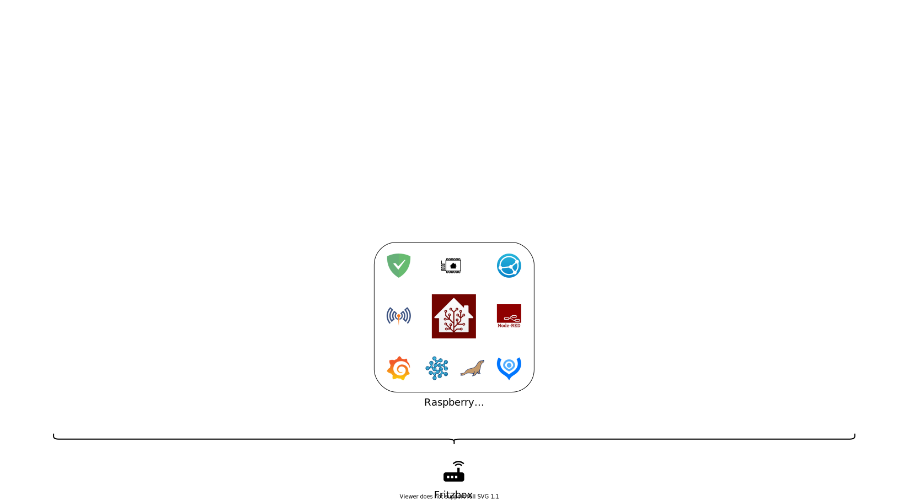

Home Assistant
--------------

* Rasperry Pi 4
* MQTT und weitere Dienste als Addons

.. note::

  Addons:

  * MQTT
  * Node-Red
  * Syncthing ...

----

:data-x: r0
:data-y: r1200

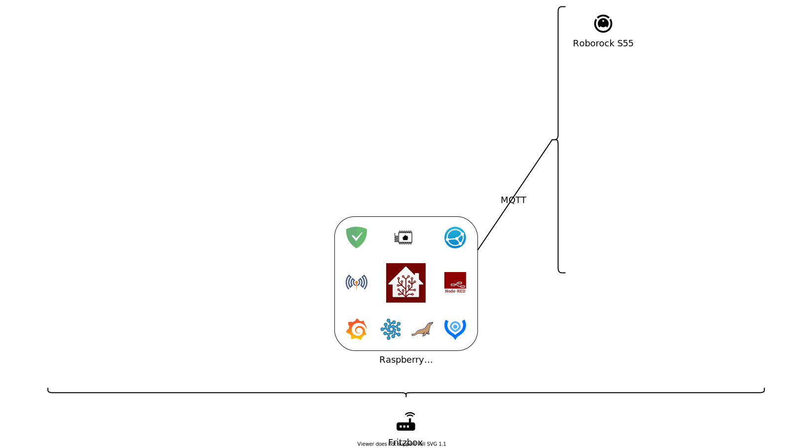

Systemübersicht
---------------

* XIAOMI Roborock S55

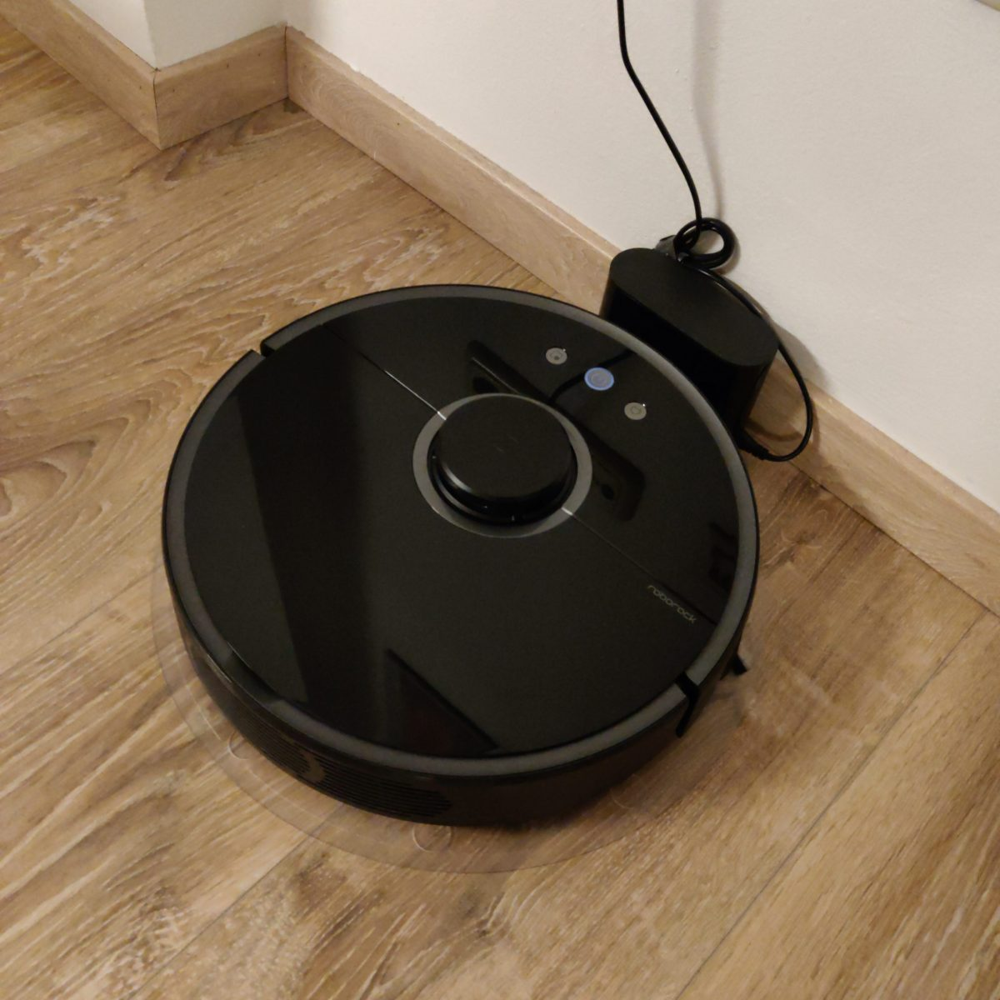

.. note::

  * Erstes IoT Gerät: Roborock per MQTT

----

Systemübersicht
---------------

* Wifi Steckdosen

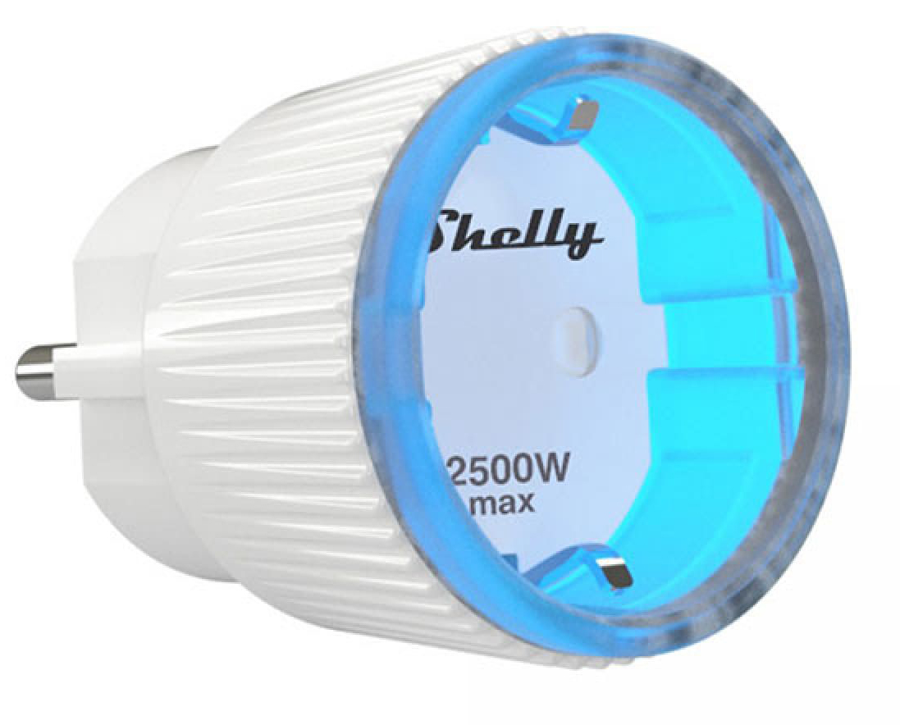

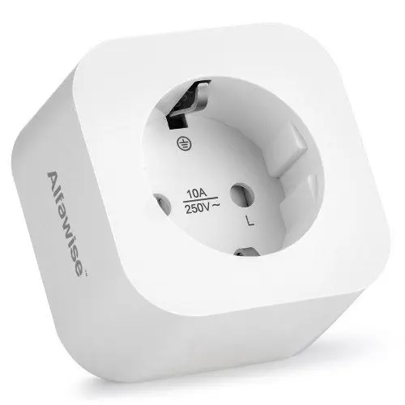

* IR für Standlüfter

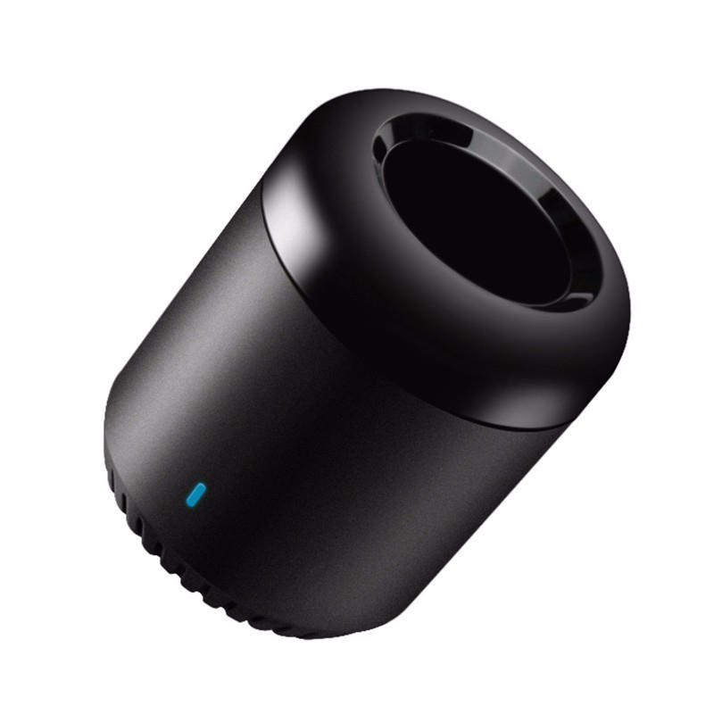

.. note::

  * 2x Alfawise PE1004T (flashed, ESPHome)
  * 2x Shelly Plug S (MQTT nativ, ohne Cloud)
  * Für Standlüfter IR Sender (Fernbedienungsersatz)

----

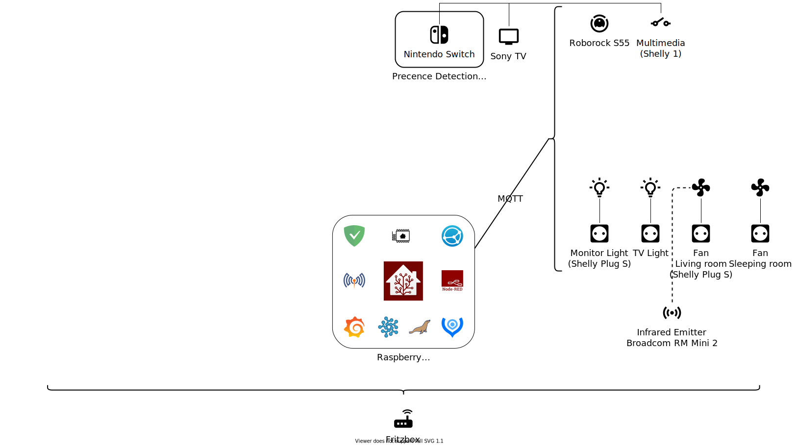

Systemübersicht
---------------

* Unterputzschalter in Steckerleiste für Multimedia und Switch

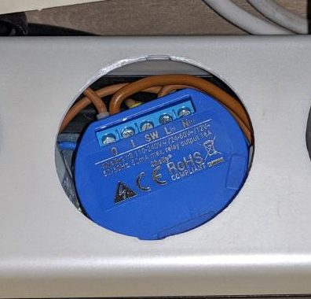

* TV und Nintendo Switch auch eingebunden

.. note::

  * Shelly 1 (ESPHome) - testen
  * Switch an/aus über Ping Präsenz

----

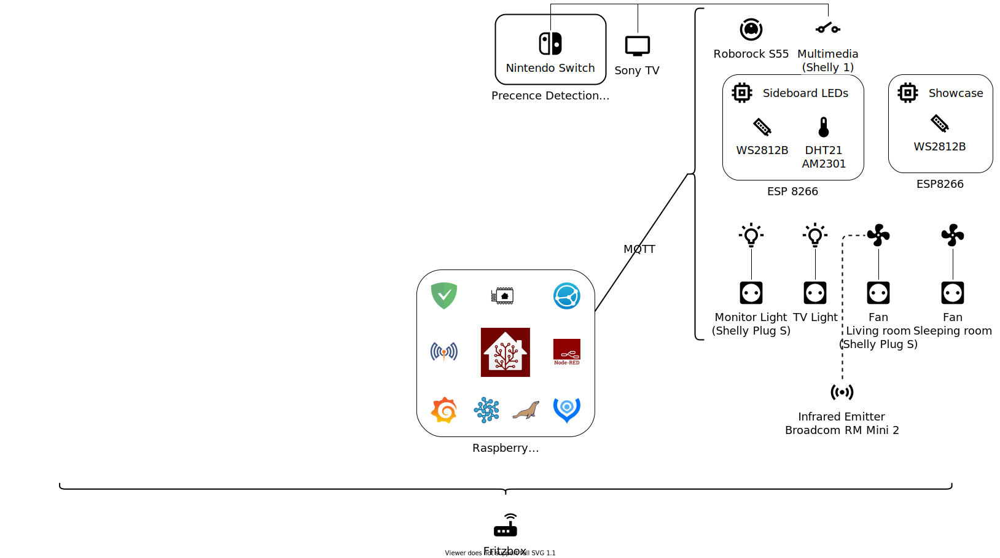

Systemübersicht
---------------

* 2 ESP8266 für LEDs und Klimamonitoring

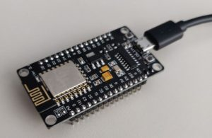

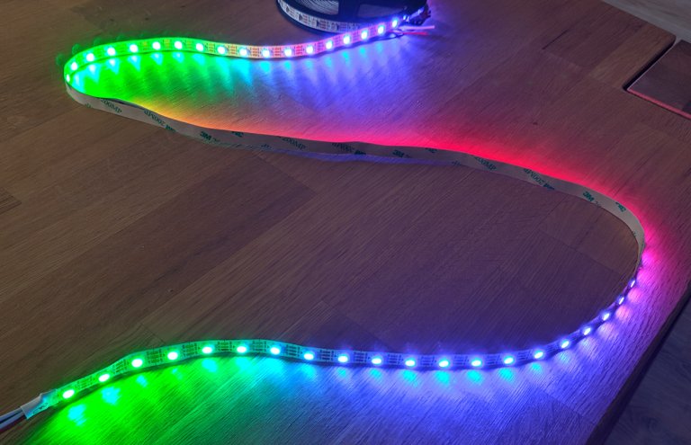

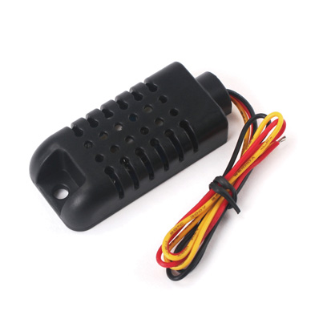

.. note::

  * 2x ESP8266 (Node-MCU Dev Board)

    * Sideboard Leds: addressierbare LEDs + Temperature / Luftfeuchte Sensor
    * Vitrine: Leds zur Glasbodenbeleuchtung

----

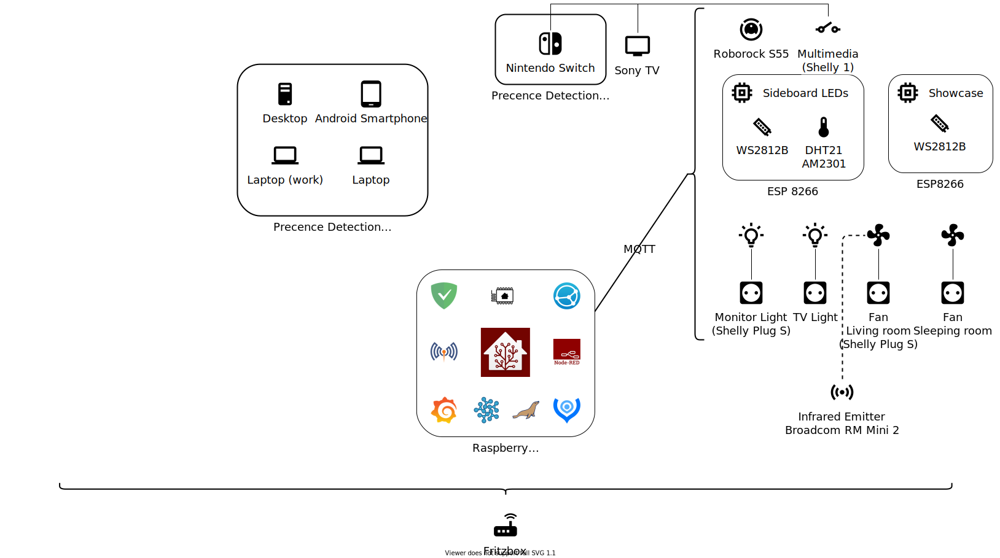

Systemübersicht
---------------

* Anwesenheitserkennung per nmap

.. note::

  * Anwesenheitserkennung für Rechner und Telefon per nmap (Automatisierung usw.)

----

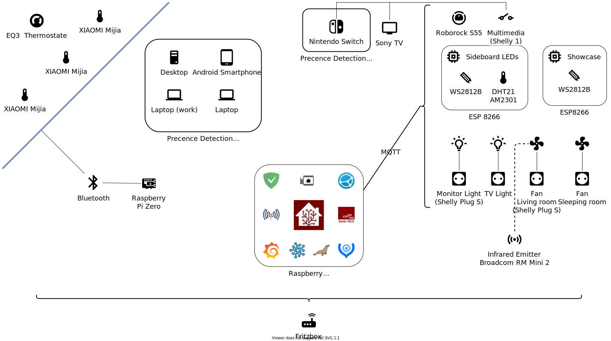

Systemübersicht
---------------

* Raspberry Pi Zero als Bluetooth Brücke
* Bluethooth Heizungsthermostat

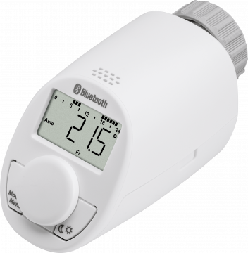

* Bluethooth Raumthermostat

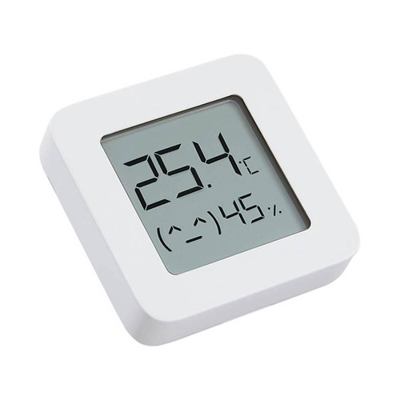

.. note::

  * Pi Zero eigentl. Sprachsteuerung, jetzt Bluetooth Brücke

    * Heizungstermostat
    * Xiaomi Raumtermostate

----

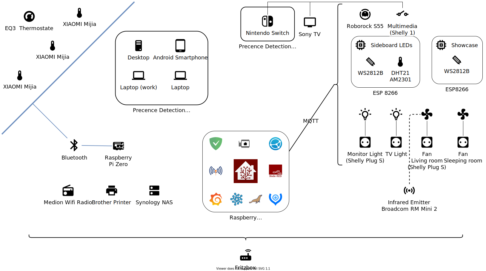

Systemübersicht
---------------

* Weitere Netzwerkgeräte

  * Wlan Radio
  * Drucker
  * NAS

.. note::

  * Zusätzlich eingebunden:

    * Wlan Radio (Audio Ausgabe TBD)
    * Drucker (Monitoring)
    * NAS (Backup)

----

:data-x: r2400
:data-y: r0

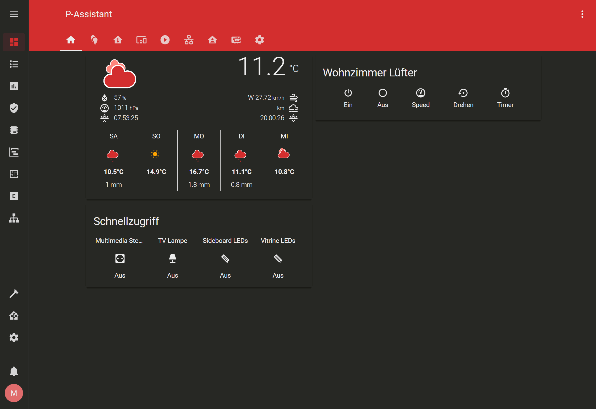

Lovelace UI
-----------

* Standard Oberfläche
* Schnelle Übersicht
* Führt Aktionen aus

|local_ha_demo|

.. |local_ha_demo| raw:: html

   <a href="https://p-assist.fritz.box:8123/lovelace/home" target="_blank">Livedemo</a>

.. note::
    Zeigen:

    * Dashboard
    * Lichter 
    * Klima
    * Geräte
    * Raspis

   -Strg-W zurück

----

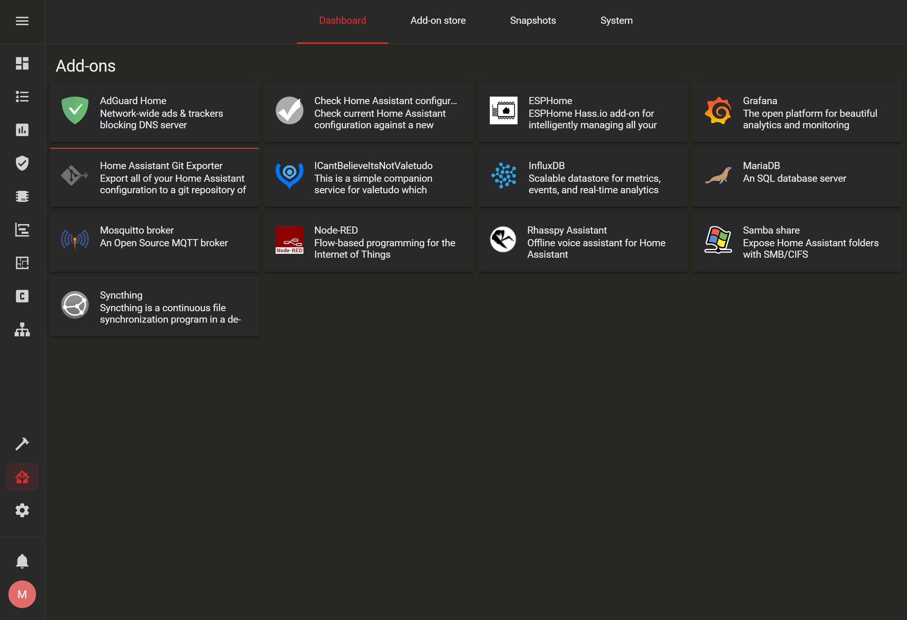

Home Assistant Addons
---------------------

* Erweiterungen für den Home Assistant Supervisor
* Unabhängige Programme
* "Alles was in einem eigenen Prozess läuft ist ein Addon"
* spezielle Dockercontainer
* Werden über den Addon-Store installiert

.. note::

  Addons-Bsp:

  * Node-Red für Automatisierung
  * ICantBelieveItsNotValetude Kartenbild vom Robo
  * AdGuard Home für Adblock und DNS-over-HTTPS

----

:data-x: r0
:data-y: r1200

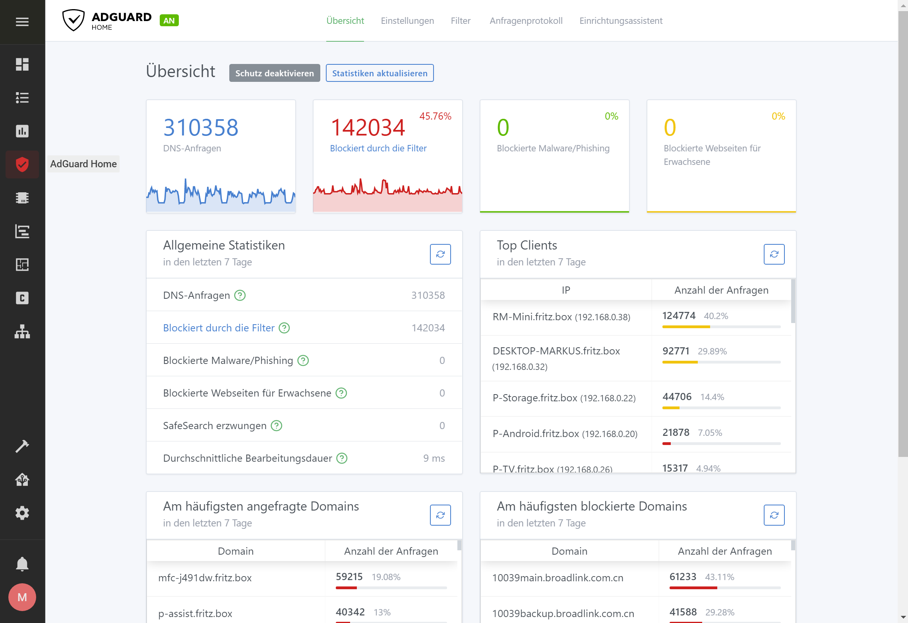

AdGuard Home
------------

* Ersetzt DNS Service des Routers
* Adblocker

  * Alle Domains der Blockierlisten werden nicht aufgelöst
  * Werbeanfragen und IoT-Heimtelefonierer offline

* Anfragen an verschiedene öffentliche DNS Provider

* Unterstützung für DNS-over-TLS und DNS-over-HTTPS
  
  * Namensauflösung kann nicht "mitgeschnitten" werden.
  * Namensauflösung kann nicht von "normalen" HTTP Anfragen unterschieden werden (DoH).

|local_adguard_demo|

.. |local_adguard_demo| raw:: html

   <a href="https://p-assist.fritz.box:8123/a0d7b954_adguard" target="_blank">Livedemo</a>

.. note::

    * DNS

      * DNS: google.de auflösen -> 216.58.207.131 -> Anfrage zu IP

    * Anfragen an verschiedene öffentliche DNS Provider

      * Streuung der Anfragen falls gewünscht
      * Ausfallsicherheit für Namensauflösung

    * Unterstützung für DNS-over-TLS und DNS-over-HTTPS    

    Zeigen:

    * Allgemeine Settings
    * Filterliste
    * DNS Settings

   -Strg-W zurück

----

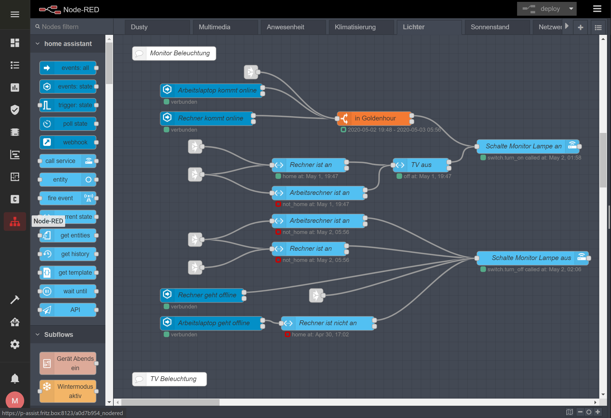

Node-Red
--------

* Automatisierungen als Logik-Abläufe
* Integration in Home Assistant

|local_node-red_demo|

.. |local_node-red_demo| raw:: html

   <a href="https://p-assist.fritz.box:8123/a0d7b954_nodered" target="_blank">Livedemo</a>

.. note::

    Zeigen:

    * Sensor anbinden und Aktion ausführen
    * Dusty Fehlermeldungen

   -Strg-W zurück

----

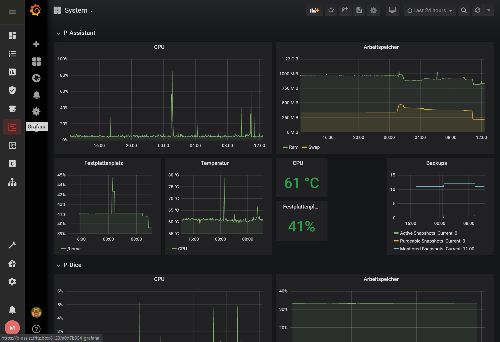

Grafana
-------

* Sensorenwerte und Zustände zusätzlich in InnoDb gespeichert

  * Optimierte Aufbewahrung in Zeitreihendatenbank

* Grafana für die Auswertung

  * "Bunte Balken und Zahlen"
  * Auswertung über längere Zeitabschnitte

|local_grafana_demo|

.. |local_grafana_demo| raw:: html

   <a href="https://p-assist.fritz.box:8123/a0d7b954_grafana" target="_blank">Livedemo</a>

.. note::

    * Adblocker über DNS

      * DNS: google.de auflösen -> 216.58.207.131 -> Anfrage zu IP

    * Anfragen an verschiedene öffentliche DNS Provider

      * Streuung der Anfragen falls gewünscht
      * Ausfallsicherheit für Namensauflösung

    * Unterstützung für DNS-over-TLS und DNS-over-HTTPS    

    Zeigen:

    * Allgemeine Settings
    * Filterliste
    * DNS Settings

   -Strg-W zurück

----

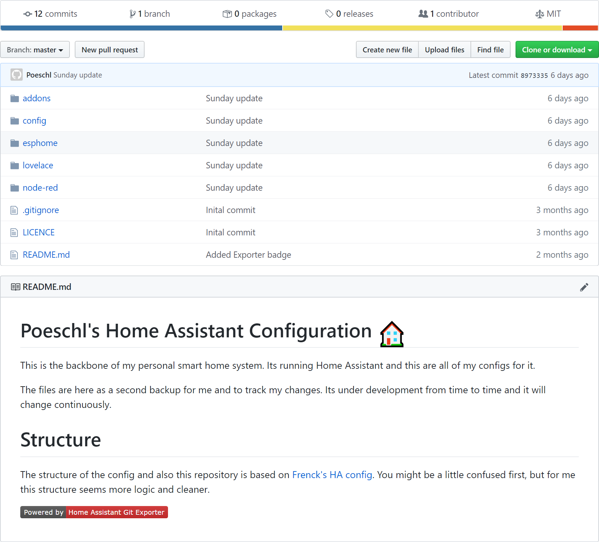

Home Assistant Git Exporter
---------------------------

* Exportiert die aktuelle Konfiguration in ein beliebiges Git Repository
* Exportiert auch Konfigurationen von einigen Addons
* Prüft auf Passwörter und sensible Daten in den Konfigurationen

Sourcecode und Installation des Addons auf GitHub:

----

:data-x: r2400
:data-y: r0

Fragen?
-------

und

The End?
--------

